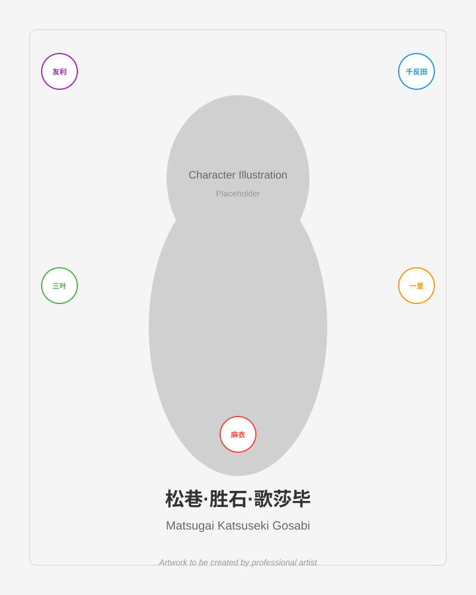

# Character Profile: 松巷·胜石·歌莎毕

## Character Name
**松巷·胜石·歌莎毕** (Matsugai Katsuseki Gosabi)

## Design Direction & Inspiration

This character draws inspiration from five beloved anime characters, combining their distinctive traits:

### Source Characters:
1. **友利奈绪 (Yuri Nao)** - Charlotte
   - Characteristics: Confident, sometimes sarcastic exterior with a caring heart
   - Visual traits: Often associated with light-colored hair, school uniform aesthetic

2. **千反田える (Chitanda Eru)** - Hyouka
   - Characteristics: Curious, polite, energetic personality
   - Visual traits: Long dark hair, large expressive eyes, traditional Japanese beauty

3. **宫水三叶 (Miyamizu Mitsuha)** - Your Name (Kimi no Na wa)
   - Characteristics: Determined, kind-hearted, connection to tradition
   - Visual traits: Dark hair often in braids, shrine maiden associations

4. **后藤一里 (Gotou Hitori / Bocchi)** - Bocchi the Rock!
   - Characteristics: Shy, introverted but talented, relatable struggles
   - Visual traits: Pink hair, casual modern style, musician aesthetic

5. **樱岛麻衣 (Sakurajima Mai)** - Rascal Does Not Dream of Bunny Girl Senpai
   - Characteristics: Mature, composed, caring beneath cool exterior
   - Visual traits: Long dark hair, elegant presence, bunny girl costume iconic

## Character Concept

松巷·胜石·歌莎毕 represents a synthesis of these beloved characters:

- **Personality**: A curious and determined individual who combines quiet introspection with bursts of energetic enthusiasm. Beneath a composed exterior lies a warm, caring nature and a deep passion for their interests.

- **Visual Design Notes**:
  - Hair: Can incorporate elements from the source characters (considering dark hair with possible highlights or accessories)
  - Eyes: Large and expressive, conveying curiosity and emotion
  - Style: Modern yet with subtle traditional elements
  - Overall aesthetic: Balance between elegant composure and approachable warmth

- **Thematic Elements**: 
  - Music and creativity (from Bocchi)
  - Curiosity and investigation (from Chitanda)
  - Tradition and modernity (from Mitsuha)
  - Hidden depths beneath the surface (from Mai)
  - Protective care for others (from Nao)

## Character Illustration

*Note: The current image is a placeholder. Full character artwork can be created by a professional artist based on the design direction above.*

## Additional Notes

This character profile serves as a design guide for creating artwork. The actual illustration should be created by a skilled artist who can blend these inspirations into a unique, original character design.

---

*Created for the skills-copilot-codespaces-vscode repository*
